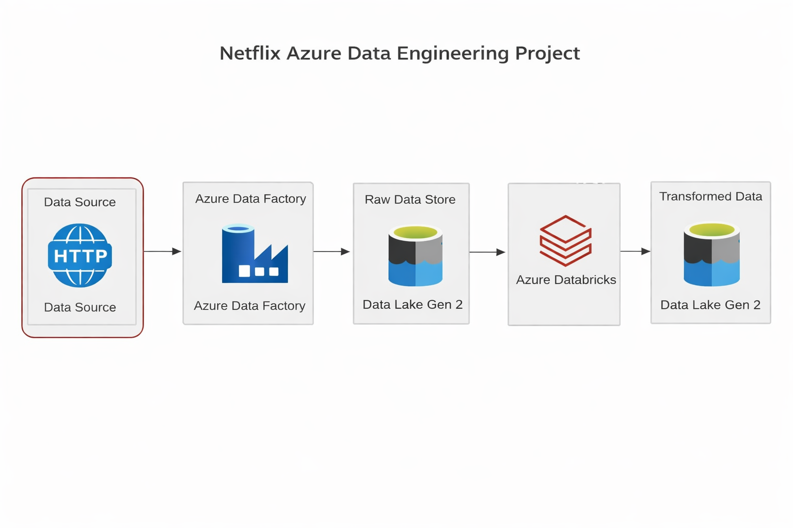
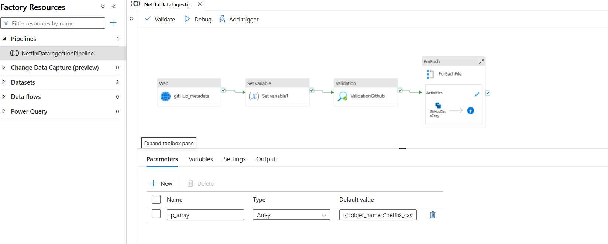
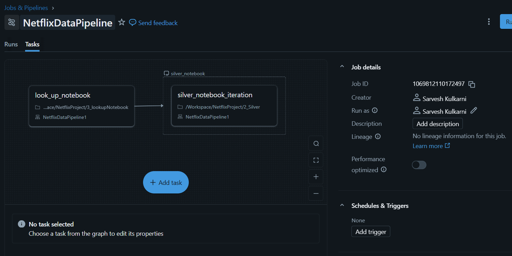
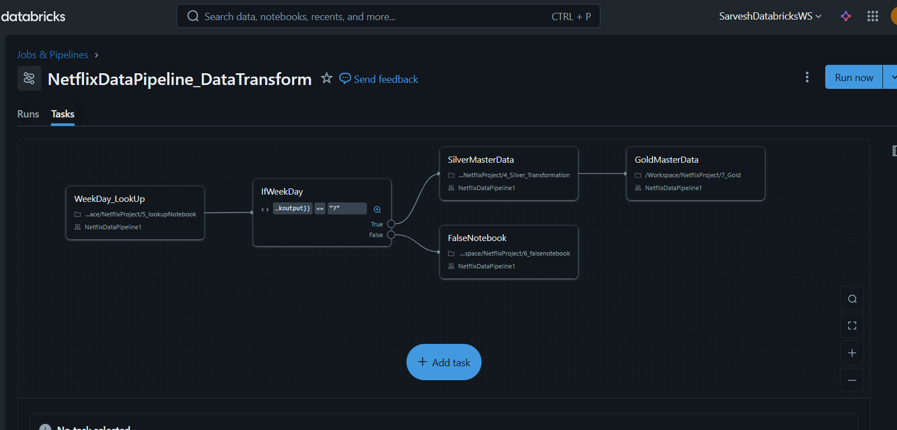

# Netflix Azure Data Engineering Project

A small end-to-end data engineering demo that ingests, processes, and organizes Netflix dataset files using Azure Data Factory / Azure services.

## Project Summary

- **Goal:** Demonstrate an Azure-based data engineering pipeline for Netflix title metadata (ingest -> silver -> gold).
- **Input data:** CSV files with titles, cast, directors, categories, and countries located in the `data/` folder.
- **Deliverables:** Example notebooks/HTML walkthroughs in `NetflixProject/` showing ingestion and transformation steps.

## Directory structure

- `data/` — source CSV files (e.g., `netflix_titles.csv`, `netflix_cast.csv`, ...)
- `image/` — architecture and pipeline diagrams used in this README
- `NetflixProject/` — HTML notebooks and walkthroughs for AutoLoader, Silver/Gold transformation, and lookups

## Architecture & Diagrams

Project architecture:

Azure Data Factory flow overview:

Data ingestion overview:

Data transformation workflow (Silver -> Gold):

## Usage

1. Inspect the source CSV files in the `data/` folder.
2. Open the example notebooks / HTML walkthroughs in `NetflixProject/` to follow the pipeline steps.
3. If you want to reproduce in Azure:

	- Provision an Azure Storage account, Azure Data Factory, and Databricks or Synapse as needed.
	- Use the diagrams in `image/` as guidance to build ADF pipelines and orchestration.

## Files of interest

- `data/netflix_titles.csv` — main titles dataset
- `data/netflix_cast.csv` — cast members
- `data/netflix_directors.csv` — directors
- `NetflixProject/1_AutoLoader.html` — AutoLoader walkthrough
- `NetflixProject/4_Silver_Transformation.html` — Silver table transformations